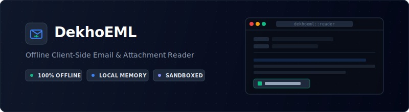
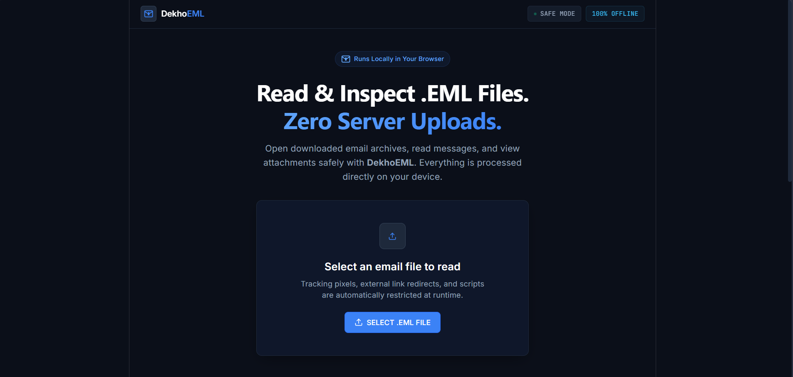

<div align="center">

 

  <br />

  [](https://react.dev/)
  [](https://fastapi.tiangolo.com/)
  [](LICENSE)
  [](#)

</div>

---

## Overview

DekhoEML is a secure, client-side email archive viewer. It allows users to open, inspect, and extract attachments from downloaded `.eml` files entirely within local memory. 

Traditional email applications often automatically download external assets or execute background scripts when rendering email files, creating potential privacy risks. DekhoEML mitigates this by utilizing an isolated local sandbox interface to block tracker queries, redirects, and background processes. Because the parsing pipeline runs on the client device, your personal data never contacts external networks or database systems.

---

### Product Preview



---

## Core Characteristics

*   **Local Processing Model:** MIME parsing and file reading occur strictly in the browser container.
*   **Secure Rendering:** HTML renders inside sandboxed frames, disabling external link queries and web beacons.
*   **Attachment Handling:** View images, PDFs, and text logs inline via clean modal views, or export them to raw formats safely.
*   **Intuitive UI Workspace:** A structured, accessible layout built using modern dark themes for readable metadata inspection.

---

## Tech Stack

The architecture utilizes a decoupled framework to keep processing logic separate from the browser layer:

| Component | Technology | Badge |
|---|---|---|
| **Frontend UI** | React, Modern CSS, ES6 JavaScript |  |
| **Local Parser API** | Python, FastAPI, Uvicorn |  |

---

## Installation and Local Setup

### Prerequisites
* **Node.js** (v16.x or newer)
* **Python** (v3.8 or newer)

### Step 1: Clone the Repository
```bash
git clone https://github.com/tropicalbee/DekhoEML.git
cd dekhoeml
```

### Step 2: Initialize the Local API Backend
Run the backend parser on your local environment to enable native parsing operations:
```bash
# Configure virtual environment
python -m venv venv
source venv/bin/activate  # Windows: venv\Scripts\activate

# Install required parsing dependencies
pip install fastapi uvicorn python-multipart

# Start the local ASGI server
uvicorn main:app --host 127.0.0.1 --port 8000
```

### Step 3: Initialize the Frontend Application
In a separate terminal directory, build and launch the browser framework:

```bash
# Install node packages
npm install

# Start the local client server
npm start
```
The application will automatically open at http://localhost:3000.

## Open Source and Collaboration
The project codebase is being prepared for transition to open source.
<br>
If you have architectural suggestions, security improvement recommendations, or parser performance ideas, please feel free to:


* Open a structured Issue to describe your enhancement ideas.
Provide suggestions regarding alternate client-side parsing designs.
* If you find this utility useful, please consider giving the repository a star. This supports the development of private, local development tooling.

## License


This project is distributed under the MIT License. Review the [LICENSE](LICENSE) file for further terms.

